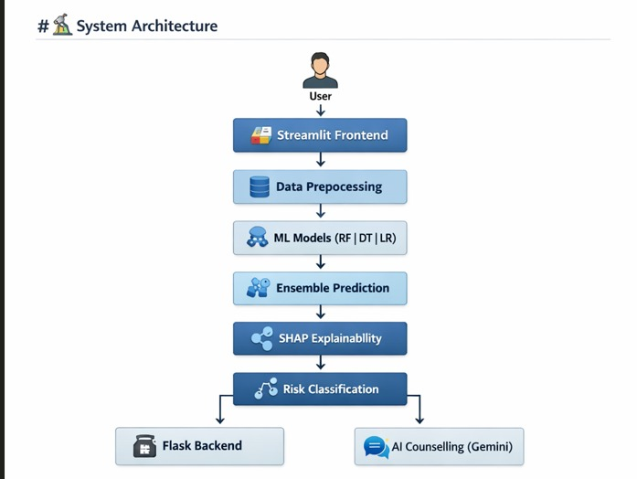
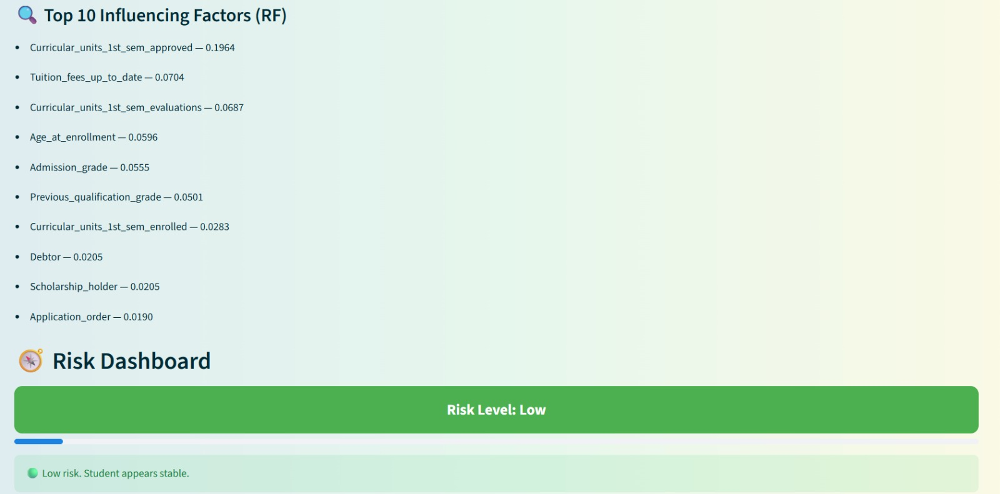
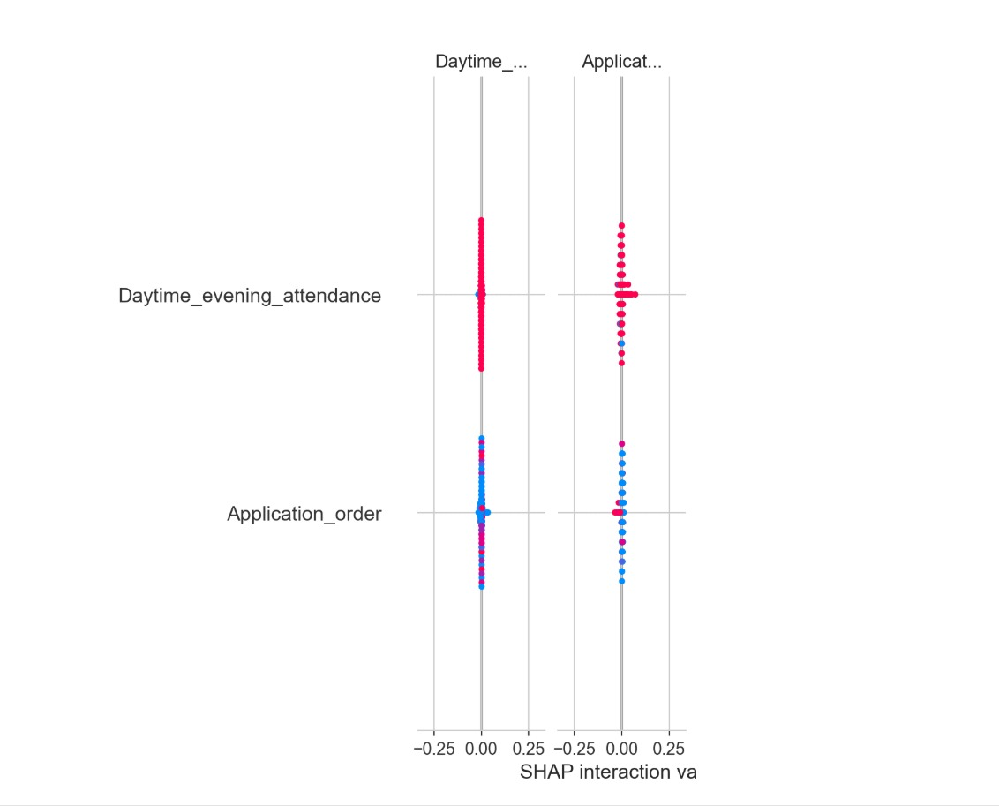
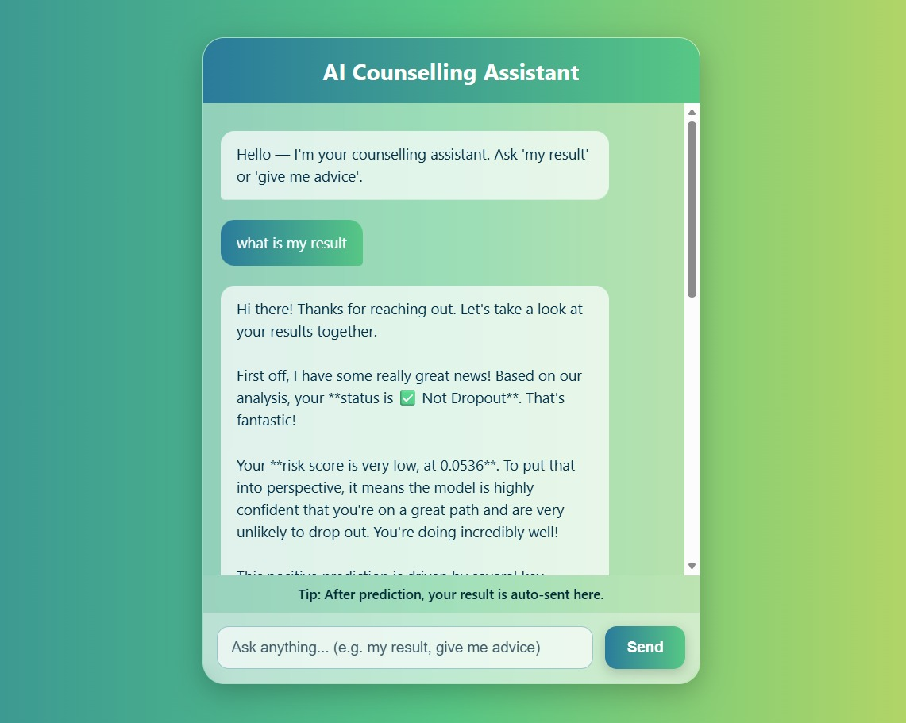

# 🎓 Student Dropout Prediction Portal


An end-to-end **AI-powered educational support system** that predicts student dropout risk at an early stage and provides **transparent explanations** along with **personalized AI-driven counselling assistance**.

---

## 📌 Overview

Student dropout is a major challenge faced by higher education institutions, often leading to academic, financial, and social consequences.  
The **Student Dropout Prediction Portal** leverages **Machine Learning**, **Explainable AI (XAI)**, and **Generative AI** to assist institutions in identifying at-risk students early and supporting timely intervention.

The system not only predicts dropout probability but also explains *why* a student is at risk, enabling educators and counsellors to make informed, ethical, and data-driven decisions.


---

## 🚀 Key Capabilities

- Machine learning–based dropout prediction
- Ensemble learning using Random Forest, Decision Tree, and Logistic Regression
- Risk classification into **Low, Medium, High, and Extreme**
- Explainable AI using SHAP and feature importance
- Interactive web interface built with Streamlit
- Flask-based backend for prediction storage and communication
- AI-powered counselling assistant using Google Gemini
- Modular, scalable, and deployment-ready architecture

---

## 🧠 Technologies & Tools

- **Python**
- **Scikit-learn**
- **SHAP (Explainable AI)**
- **Streamlit**
- **Flask**
- **Google Gemini API**
- **Pandas, NumPy, Matplotlib**
- **Git & GitHub**

---

## 🏗️ System Architecture





---

## 📊 Prediction Dashboard

The dashboard allows users to input student demographic, academic, and socio-economic data and receive real-time predictions with risk visualization.



---

## 🔍 Explainable AI (XAI)

To ensure transparency and trust, the system explains each prediction using SHAP values and feature importance, highlighting the most influential factors contributing to dropout risk.



---

## 🤖 AI Counselling Assistant

An AI-powered counselling module generates personalized academic guidance based on the predicted risk level and contributing factors.



---

## 📈 Risk Interpretation

| Risk Level | Meaning |
|-----------|--------|
| Low | Student is academically stable |
| Medium | Monitoring and guidance advised |
| High | Counselling intervention recommended |
| Extreme | Immediate academic intervention required |

---

## 🧪 Testing & Validation

- Model evaluation using accuracy, precision, recall, and F1-score
- Cross-model consistency testing
- API and UI integration testing
- Edge-case handling for incomplete or extreme inputs

---

## ⚖️ Ethical AI Considerations

- Transparent and interpretable predictions
- No automated enforcement of decisions
- Designed to assist educators, not replace human judgement
- Responsible use of student data

---

## 📚 References

- UCI Student Performance Dataset
- Scikit-learn Documentation
- SHAP Documentation
- Streamlit Documentation
- Flask Documentation

---

## 👩‍💻 Author

**Vishuddhi Jain**  
📧 Email: [vishuddhi0303.jain@gmail.com](mailto:vishuddhi0303.jain@gmail.com)  
🎓 B.Tech Engineering Student
```

---
